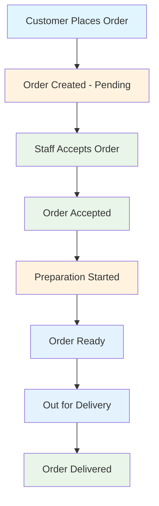

# 🏟️ Stadium Drink Ordering System

A complete, production-ready drink ordering and ticketing system for stadium events, built with modern .NET technologies, Docker containers, and cloud-native architecture.

## 🎯 System Overview

The Stadium Drink Ordering System is a **microservices-based application** that enables seamless drink ordering and event ticket purchasing at stadium events. It consists of four main applications working together to provide a complete solution for customers, staff, and administrators.

### 🏗️ Architecture Components

| Component | Technology | Port | Purpose |
|-----------|------------|------|---------|
| **API Backend** | ASP.NET Core 8.0 | 9000/8080 | RESTful API with authentication & business logic |
| **Customer App** | Blazor Server | 9001/8081 | Customer-facing ticketing & drink ordering interface |
| **Admin App** | Blazor Server | 9002/8082 | Management dashboard for analytics & administration |
| **Staff App** | Blazor Server | 9003/8083 | Order fulfillment & delivery management |
| **Database** | PostgreSQL/Supabase | Cloud | Enterprise-grade database with Entity Framework Core |

## ✨ Key Features

### 👥 Customer Features
- **Event Ticketing System** - Browse events, select seats, and purchase tickets
- **Interactive Seat Selection** - Visual stadium map with real-time availability
- **Shopping Cart** - Session-based cart with 15-minute seat reservations
- **Intuitive Drink Browsing** - Filter by category (Beer, Soft Drinks, Water, Coffee, etc.)
- **Smart Cart Management** - Add items with quantity and special instructions
- **Ticket-Based Ordering** - Use seat ticket numbers for verification
- **Real-Time Order Tracking** - Live status updates from Pending to Delivered
- **Order History** - Complete history of past orders and tickets
- **Responsive Design** - Works on mobile, tablet, and desktop
- **Multi-language Support** - English and Croatian with cookie persistence

### 🛠️ Admin Features
- **Business Analytics Dashboard** - Revenue tracking and performance metrics
- **Customer Analytics** - User behavior tracking and engagement metrics
- **Inventory Management** - CRUD operations for drinks and stock levels
- **Event Management** - Create and manage stadium events with pricing tiers
- **Staff Role Management** - Different access levels (Admin, Bartender, Waiter)
- **Financial Reporting** - Sales summaries and tax reports
- **System Administration** - User management and configuration
- **Performance Analytics** - Track popular items and peak times
- **Stadium Structure Management** - Import/export stadium layouts via JSON
- **Interactive Stadium Visualization** - Visual seat mapping and management
- **Centralized Logging** - Enterprise-grade logging with search and analytics
- **Data Grid Management** - Advanced data tables with filtering and export

### 👨‍💼 Staff Features  
- **Real-time Order Queue** - Live order management with priority sorting
- **Order Assignment System** - Accept and assign orders to staff members
- **Interactive Stadium Map** - Visual seat-based order tracking
- **Delivery Route Optimization** - Batch orders by stadium section
- **Mobile-Optimized Interface** - Tablet-friendly for on-the-go staff
- **Status Management** - Track orders from preparation to delivery

### 🔧 Technical Features
- **JWT Authentication** - Secure token-based authentication with persistent tokens
- **Role-Based Authorization** - Granular permission system
- **PostgreSQL Database** - Enterprise-grade database with Supabase cloud hosting
- **Entity Framework Core** - Code-first migrations with PostgreSQL provider
- **Database Migrations** - Automatic schema updates with rollback support
- **Health Checks** - Service health monitoring with database connectivity checks
- **Docker Support** - Complete containerization with multi-stage builds
- **Multi-Environment** - Development, staging, and production configs
- **JSON Data Import/Export** - Stadium structure management with validation
- **SignalR Real-time Updates** - Live order status notifications via hubs
- **Centralized Logging** - High-performance batch processing with retention management
- **Background Services** - Automated cleanup and maintenance tasks

### 🎨 UI/UX Features
- **Responsive Design** - Mobile-first approach with Bootstrap 5
- **Modern Authentication UI** - Polished login/registration forms with gradient headers
- **Top Navigation Bar** - Login/Sign-up buttons prominently placed in top-right corner
- **Adaptive Form Layouts** - Optimized column widths for all screen sizes
- **Custom Styling** - Professional auth pages with shadows, rounded corners, and hover effects
- **User Dropdown Menu** - Clean profile management for authenticated users
- **Consistent Theming** - Unified design language across Customer, Admin, and Staff apps

## 🚀 Quick Start

### Prerequisites
- **Docker & Docker Compose** (recommended)
- **.NET 8.0 SDK** (for local development)
- **Git** (for cloning)

### 🐳 Docker Setup (Recommended - 2 minutes)

```bash
# Clone the repository
git clone <repository-url>
cd StadiumDrinkOrdering

# Make scripts executable (Linux/macOS)
chmod +x scripts/*.sh

# Start development environment
./scripts/start-dev.sh
```

**Access URLs:**
- 🎯 **Customer App**: http://localhost:9001
- 🛠️ **Admin App**: http://localhost:9002
- 👨‍💼 **Staff App**: http://localhost:9003
- 🔧 **API**: http://localhost:9000
- 📚 **API Documentation**: http://localhost:9000/swagger

### 🏭 Production Deployment

```bash
# Copy environment template
cp env.template .env

# Edit .env with your settings
nano .env

# Start production environment
./scripts/start-prod.sh
```

**Production URLs:**
- Customer App: http://localhost:8081
- Admin App: http://localhost:8082
- Staff App: http://localhost:8083
- API: http://localhost:8080

### 💻 Local Development Setup

#### Option 1: Visual Studio (Recommended for Windows)
1. Open `StadiumDrinkOrdering.sln` in Visual Studio 2022
2. Set `StadiumDrinkOrdering.AppHost` as startup project
3. Press F5 to run with Aspire orchestration

#### Option 2: Command Line
```bash
# Install .NET 8.0 SDK
# Install SQL Server (LocalDB is fine)

# Start API
cd StadiumDrinkOrdering.API
dotnet run --urls "https://localhost:7000;http://localhost:7001"

# Start Customer App (new terminal)
cd StadiumDrinkOrdering.Customer
dotnet run --urls "https://localhost:7002;http://localhost:7003"

# Start Admin App (new terminal)
cd StadiumDrinkOrdering.Admin
dotnet run --urls "https://localhost:7004;http://localhost:7005"

# Start Staff App (new terminal)
cd StadiumDrinkOrdering.Staff
dotnet run --urls "https://localhost:7006;http://localhost:7007"
```

## 🔐 Default Credentials

| Role | Email | Password | Access |
|------|-------|----------|---------|
| **Admin** | `admin@stadium.com` | `admin123` | Full system access |
| **Staff** | `staff@stadium.com` | `staff123` | Order management |
| **Customer** | Register new account | - | Customer features |
| **Test User** | `test@test.com` | `test123` | Testing purposes |

## 📊 Database & Sample Data

The system automatically creates the database and seeds comprehensive sample data:

### 🍹 Sample Drinks
- **Beer**: Heineken, Budweiser, Corona
- **Soft Drinks**: Coca-Cola, Pepsi, Sprite
- **Water**: Still, Sparkling
- **Coffee**: Espresso, Cappuccino, Americano
- **Juice**: Orange, Apple

### 🎫 Sample Tickets
- `TICKET001` - Section A, Row 1, Seat 1
- `TICKET002` - Section B, Row 5, Seat 12
- `TICKET003` - Section C, Row 10, Seat 25
- `TICKET004` - VIP Section, Row 2, Seat 8
- `TICKET005` - General Admission, Row 20, Seat 50

## 🏗️ Project Structure

```
StadiumDrinkOrdering/
├── 📁 StadiumDrinkOrdering.API/          # REST API Backend
│   ├── Controllers/                     # API Controllers
│   ├── Services/                        # Business Logic
│   ├── Data/                           # Database Context
│   ├── Models/                         # Entity Models
│   └── Program.cs                      # API Configuration
├── 📁 StadiumDrinkOrdering.Customer/    # Customer Blazor App
│   ├── Pages/                          # Blazor Pages
│   ├── Services/                       # HTTP Services
│   ├── Shared/                         # Shared Components
│   └── Program.cs                      # App Configuration
├── 📁 StadiumDrinkOrdering.Admin/       # Admin Blazor App
│   ├── Pages/                          # Blazor Pages
│   ├── Services/                       # HTTP Services
│   ├── Shared/                         # Shared Components
│   └── Program.cs                      # App Configuration
├── 📁 StadiumDrinkOrdering.Staff/       # Staff Blazor App
│   ├── Pages/                          # Blazor Pages
│   ├── Services/                       # HTTP Services
│   ├── Shared/                         # Shared Components
│   └── Program.cs                      # App Configuration
├── 📁 StadiumDrinkOrdering.Shared/      # Shared Models & DTOs
│   ├── Models/                         # Entity Models
│   └── DTOs/                          # Data Transfer Objects
├── 📁 scripts/                         # Automation Scripts
│   ├── start-dev.sh                   # Development startup
│   ├── start-prod.sh                  # Production startup
│   ├── validate-setup.sh              # Environment validation
│   └── wait-for-db.sh                 # Database wait script
├── 📁 docker-compose.*                 # Docker configurations
├── 📁 env.template                     # Environment variables
└── 📁 StadiumDrinkOrdering.AppHost/   # .NET Aspire orchestration
```

## 🔄 Order Workflow



## 🛡️ Security Features

- **JWT Token Authentication** - Stateless, scalable authentication
- **Role-Based Authorization** - Granular permission control
- **BCrypt Password Hashing** - Industry-standard password security
- **CORS Configuration** - Secure cross-origin requests
- **Input Validation** - Comprehensive data validation
- **SQL Injection Prevention** - Parameterized queries via EF Core

## 🐳 Docker Architecture

### Development Stack
```
┌─────────────────┐  ┌─────────────────┐  ┌─────────────────┐  ┌─────────────────┐  ┌─────────────────┐
│   SQL Server    │  │   API Backend   │  │  Customer App   │  │   Admin App     │  │   Staff App     │
│   Port: 14330   │  │   Port: 9000    │  │   Port: 9001    │  │   Port: 9002    │  │   Port: 9003    │
│   Volume: sql   │  │   Health Check  │  │   Health Check  │  │   Health Check  │  │   Health Check  │
└─────────────────┘  └─────────────────┘  └─────────────────┘  └─────────────────┘  └─────────────────┘
         │                      │                      │                      │                      │
         └──────────────────────┼──────────────────────┼──────────────────────┼──────────────────────┘
                                │                      │                      │
                          stadium-network (Docker Bridge)
```

### Production Stack
- **Multi-stage builds** for optimized image sizes
- **Health checks** for all services
- **Non-root users** for security
- **Persistent volumes** for database data
- **Resource limits** for production deployments
- **Environment-specific configurations**

## 🔧 Configuration

### Environment Variables (.env file)
```bash
# Database Configuration
SQL_SA_PASSWORD=YourStrongPassword123!

# JWT Configuration
JWT_SECRET_KEY=YourSuperSecretKeyThatIsAtLeast32CharactersLong!

# Environment
ASPNETCORE_ENVIRONMENT=Production

# Resource Limits
DB_MEMORY_LIMIT=2G
API_MEMORY_LIMIT=512M
FRONTEND_MEMORY_LIMIT=256M
```

### API Configuration (appsettings.json)
```json
{
  "ConnectionStrings": {
    "DefaultConnection": "Server=sqlserver,1433;Database=StadiumDrinkOrdering;..."
  },
  "JwtSettings": {
    "SecretKey": "YourSuperSecretKey...",
    "Issuer": "StadiumDrinkOrdering",
    "Audience": "StadiumDrinkOrdering",
    "ExpirationMinutes": 60
  },
  "Logging": {
    "LogLevel": {
      "Default": "Information"
    }
  }
}
```

## 🚀 API Endpoints

### 🔐 Authentication
- `POST /api/auth/login` - User authentication
- `POST /api/auth/register` - New user registration
- `POST /api/auth/refresh` - Token refresh

### 🍹 Drinks Management
- `GET /api/drinks` - Get all drinks (paginated)
- `GET /api/drinks/{id}` - Get specific drink
- `POST /api/drinks` - Create drink (Admin only)
- `PUT /api/drinks/{id}` - Update drink (Admin only)
- `DELETE /api/drinks/{id}` - Delete drink (Admin only)

### 📋 Orders
- `POST /api/orders` - Create new order
- `GET /api/orders` - Get all orders (Staff only)
- `GET /api/orders/my-orders` - Get user's orders
- `GET /api/orders/{id}` - Get order details
- `PUT /api/orders/{id}/status` - Update order status
- `POST /api/orders/{id}/cancel` - Cancel order

### 🎫 Event Ticketing
- `GET /api/customer/ticketing/events` - Browse available events
- `GET /api/customer/ticketing/events/{eventId}` - Get event details
- `GET /api/customer/ticketing/events/{eventId}/sections/{sectionId}/availability` - Check seat availability
- `POST /api/customer/orders/create` - Process ticket purchase

### 🛒 Shopping Cart
- `GET /api/customer/cart?sessionId={sessionId}` - Get cart contents
- `POST /api/customer/cart/add` - Add seat to cart
- `DELETE /api/customer/cart/remove` - Remove from cart
- `DELETE /api/customer/cart/clear` - Clear entire cart

### 🎫 Tickets
- `GET /api/tickets/validate/{ticketNumber}` - Validate ticket
- `GET /api/tickets/{ticketNumber}` - Get ticket details

### 🏟️ Stadium Structure
- `GET /api/stadiumstructure/summary` - Get stadium summary statistics
- `GET /api/stadiumstructure/full-structure` - Get complete stadium structure
- `POST /api/stadiumstructure/import/json` - Import stadium structure from JSON
- `GET /api/stadiumstructure/export/json` - Export stadium structure to JSON
- `DELETE /api/stadiumstructure/clear` - Clear all stadium structure data

### 📊 Analytics & Logging
- `GET /api/analytics/dashboard` - Dashboard metrics
- `GET /api/customeranalytics/overview` - Customer behavior analytics
- `POST /api/logs/search` - Search centralized logs
- `GET /api/logs/summary` - Log statistics

### 👥 User Management (Admin only)
- `POST /api/users/search` - Search users with filters
- `GET /api/users/{id}` - Get user details
- `POST /api/users` - Create new user
- `PUT /api/users/{id}` - Update user
- `DELETE /api/users/{id}` - Delete user
- `PUT /api/users/{id}/password` - Change user password

## 🧪 Testing & Development

### Running Tests
```bash
# Run all tests
dotnet test

# Run specific test project
dotnet test StadiumDrinkOrdering.Tests

# Run with coverage
dotnet test /p:CollectCoverage=true

# Run Playwright tests
npx playwright test

# Run Playwright tests in headed mode
npx playwright test --headed

# Run specific Playwright test
npx playwright test tests/login.spec.ts
```

### Database Migrations
```bash
# Add new migration
dotnet ef migrations add NewMigration -p StadiumDrinkOrdering.API

# Update database
dotnet ef database update -p StadiumDrinkOrdering.API

# Generate SQL script
dotnet ef migrations script -p StadiumDrinkOrdering.API
```

## 🐛 Troubleshooting

### Common Issues

#### Port Already in Use
```bash
# Check what's using the port
lsof -i :9000

# Kill process
kill -9 <PID>
```

#### Database Connection Issues
```bash
# Check SQL Server container
docker logs stadium-sqlserver

# Reset database
docker-compose down -v
docker-compose up --build
```

#### Docker Issues
```bash
# Clean Docker system
docker system prune -a

# Rebuild without cache
docker-compose build --no-cache
```

### Health Checks
All services include health checks:
- **API**: http://localhost:9000/health
- **Customer**: http://localhost:9001/health
- **Admin**: http://localhost:9002/health
- **Staff**: http://localhost:9003/health

## 🔧 Recent Bug Fixes & Improvements

### Authentication Token Persistence (Fixed) ✅
**Issue**: Admin authentication tokens were lost after page navigation, requiring re-login.
**Solution**: Implemented `TokenStorageService` singleton to persist authentication tokens across scoped service instances.

### File Upload Issues (Fixed) ✅
**Issue**: Stadium structure JSON imports failed with "file length = 0" errors.
**Solution**: Added stream position reset (`fileStream.Position = 0`) before HTTP multipart uploads.

### JSON Deserialization (Fixed) ✅
**Issue**: Valid JSON files were rejected with validation errors like "Stadium name is required".
**Solution**: Configured `JsonSerializer` with `PropertyNamingPolicy.CamelCase` for proper camelCase to PascalCase mapping.

### HttpClient BaseAddress Configuration (Fixed) ✅
**Issue**: "Invalid request URI" errors when using singleton service patterns.
**Solution**: Properly configured HttpClient with dependency injection using `IHttpClientFactory` and named clients.

## 📈 Monitoring & Logging

### Application Insights (Optional)
```json
{
  "ApplicationInsights": {
    "ConnectionString": "InstrumentationKey=your-key"
  }
}
```

### Structured Logging
- **Serilog** integration for structured logs
- **Seq** support for log aggregation
- **Console** output for development

## 🚀 Deployment Options

### 🐳 Docker Swarm
```bash
# Initialize swarm
docker swarm init

# Deploy stack
docker stack deploy -c docker-compose.yml stadium
```

### ☸️ Kubernetes
```bash
# Apply manifests
kubectl apply -f k8s/

# Check status
kubectl get pods -n stadium
```

### 🌐 Cloud Platforms
- **Azure Container Apps** - Native .NET support
- **AWS ECS** - Container orchestration
- **Google Cloud Run** - Serverless containers

## 🔄 CI/CD Pipeline

### GitHub Actions (Example)
```yaml
name: Build and Deploy
on:
  push:
    branches: [ main ]
jobs:
  build:
    runs-on: ubuntu-latest
    steps:
      - uses: actions/checkout@v3
      - name: Build Docker images
        run: docker-compose build
      - name: Run tests
        run: dotnet test
```

## 🎯 Future Enhancements

### Phase 1 - Immediate (Completed)
- [x] Real-time notifications with SignalR ✅
- [x] Stadium structure management ✅
- [x] Event ticketing system ✅
- [x] Shopping cart with seat reservations ✅
- [x] Multi-language support (EN/HR) ✅
- [x] Centralized logging system ✅
- [x] Customer analytics ✅

### Phase 2 - In Progress
- [ ] Payment processing integration (Stripe/PayPal)
- [ ] Mobile app with MAUI
- [ ] QR code ticket validation
- [ ] Email notifications
- [ ] PDF ticket generation

### Phase 3 - Advanced
- [ ] AI-powered demand forecasting
- [ ] Loyalty program integration
- [ ] Advanced analytics dashboard with ML insights
- [ ] Seat recommendation engine
- [ ] Dynamic pricing

### Phase 4 - Enterprise
- [ ] Multi-venue support
- [ ] Franchise management
- [ ] API rate limiting
- [ ] Advanced caching (Redis)
- [ ] Microservices decomposition
- [ ] Kubernetes deployment

## 🤝 Contributing

We welcome contributions! Please see our [Contributing Guide](CONTRIBUTING.md) for details.

### Development Workflow
1. Fork the repository
2. Create feature branch (`git checkout -b feature/amazing-feature`)
3. Commit changes (`git commit -m 'Add amazing feature'`)
4. Push to branch (`git push origin feature/amazing-feature`)
5. Open Pull Request

### Code Standards
- **C# Coding Conventions** - Follow Microsoft guidelines
- **Clean Architecture** - Domain-driven design
- **Unit Tests** - Minimum 80% coverage
- **API Documentation** - XML comments for all public APIs

## 📄 License

This project is licensed under the **MIT License** - see the [LICENSE](LICENSE) file for details.

## 🆘 Support

- **Documentation**: Check the `/docs` folder
- **Issues**: [GitHub Issues](https://github.com/your-repo/issues)
- **Discussions**: [GitHub Discussions](https://github.com/your-repo/discussions)
- **Email**: support@stadiumordering.com

---

<div align="center">
  <p>
    <strong>Built with ❤️ for stadium events worldwide</strong>
  </p>
  <p>
    <a href="#-quick-start">Get Started</a> •
    <a href="#-api-endpoints">API Docs</a> •
    <a href="#-troubleshooting">Support</a>
  </p>
</div>
