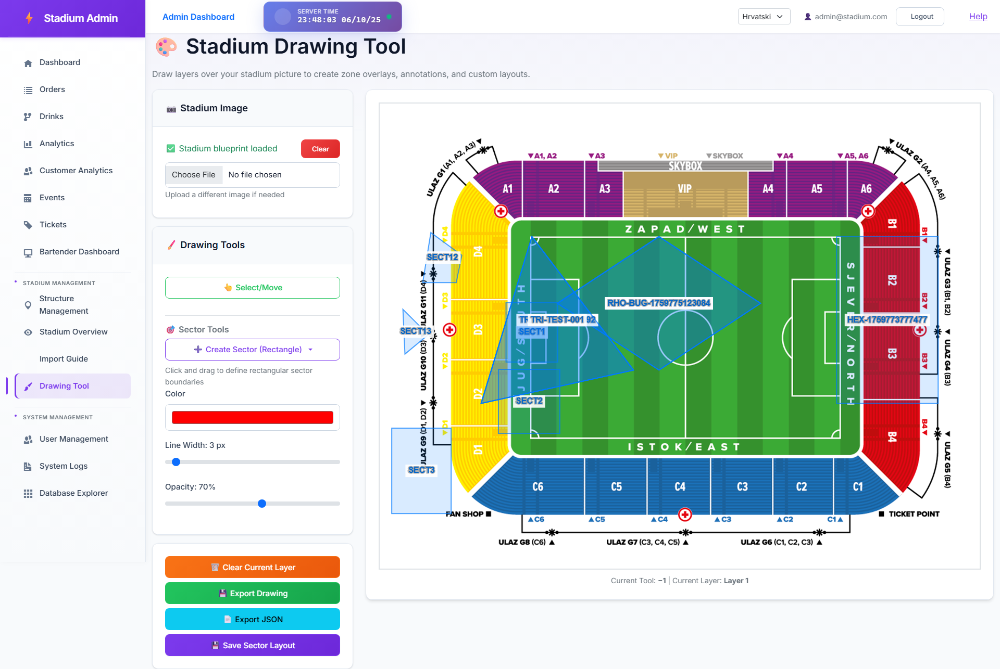
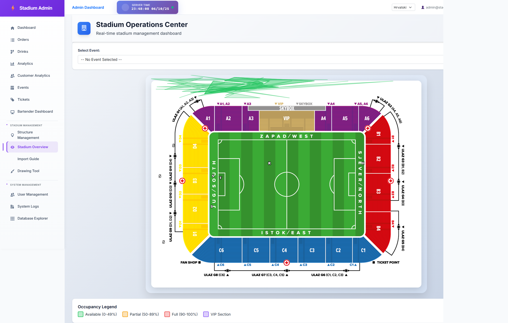

# Visual Sector Comparison Report

**Generated:** 2025-10-06T21:48:09.981Z

---

## Screenshots

### Drawing Tool Page

**Path:** `D:\AiApps\StadiumApp\StadiumApp\drawing-tool-comparison.png`

### Stadium Overview Page

**Path:** `D:\AiApps\StadiumApp\StadiumApp\stadium-overview-comparison.png`

---

## Database Statistics

**Total Sectors:** 13

### Shape Type Distribution

- **rectangle:** 4 sectors
- **rhombus:** 3 sectors
- **custompolygon:** 2 sectors
- **triangle:** 4 sectors

---

## First 5 Sectors (Detailed Data)

### 1. Sector HEX-1759773777477

| Property | Value |
|----------|-------|
| **Sector Code** | HEX-1759773777477 |
| **Shape Type** | rectangle |
| **Top Position** | 28.486607142857146% |
| **Left Position** | 74.97916666666666% |
| **Width** | 16.666666666666686% |
| **Height** | 35.714285714285715% |
| **Shape Data** | `[{"X":91.64583333333334,"Y":28.486607142857146,"Order":null},{"X":91.64583333333334,"Y":64.20089285714286,"Order":null},{"X":74.97916666666666,"Y":57.058035714285715,"Order":null},{"X":74.979166666666...` |

### 2. Sector RHO-BUG-1759774941211

| Property | Value |
|----------|-------|
| **Sector Code** | RHO-BUG-1759774941211 |
| **Shape Type** | rhombus |
| **Top Position** | 28.486607142857146% |
| **Left Position** | 29.166666666666668% |
| **Width** | 33.33333333333333% |
| **Height** | 28.57142857142857% |
| **Shape Data** | `[{"X":45.83333333333333,"Y":28.486607142857146,"Order":null},{"X":62.5,"Y":42.77232142857143,"Order":null},{"X":45.83333333333333,"Y":57.058035714285715,"Order":null},{"X":29.166666666666668,"Y":42.77...` |

### 3. Sector RHO-BUG-1759775035059

| Property | Value |
|----------|-------|
| **Sector Code** | RHO-BUG-1759775035059 |
| **Shape Type** | rhombus |
| **Top Position** | 28.486607142857146% |
| **Left Position** | 29.166666666666668% |
| **Width** | 33.33333333333333% |
| **Height** | 28.57142857142857% |
| **Shape Data** | `[{"X":45.83333333333333,"Y":28.486607142857146,"Order":null},{"X":62.5,"Y":42.77232142857143,"Order":null},{"X":45.83333333333333,"Y":57.058035714285715,"Order":null},{"X":29.166666666666668,"Y":42.77...` |

### 4. Sector RHO-BUG-1759775123084

| Property | Value |
|----------|-------|
| **Sector Code** | RHO-BUG-1759775123084 |
| **Shape Type** | rhombus |
| **Top Position** | 28.486607142857146% |
| **Left Position** | 29.166666666666668% |
| **Width** | 33.33333333333333% |
| **Height** | 28.57142857142857% |
| **Shape Data** | `[{"X":45.83333333333333,"Y":28.486607142857146,"Order":null},{"X":62.5,"Y":42.77232142857143,"Order":null},{"X":45.83333333333333,"Y":57.058035714285715,"Order":null},{"X":29.166666666666668,"Y":42.77...` |

### 5. Sector SECT1

| Property | Value |
|----------|-------|
| **Sector Code** | SECT1 |
| **Shape Type** | rectangle |
| **Top Position** | 42.629464285714285% |
| **Left Position** | 20.729166666666668% |
| **Width** | 8.5% |
| **Height** | 12.714285714285714% |
| **Shape Data** | `{"leftPercent":3.8125,"topPercent":50.77232142857143,"widthPercent":8.5,"heightPercent":12.714285714285714}` |

---

## All Sectors Summary

| # | Sector Code | Shape Type | Position (Top, Left) | Size (W×H) |
|---|-------------|------------|---------------------|------------|
| 1 | HEX-1759773777477 | rectangle | 28.486607142857146%, 74.97916666666666% | 16.666666666666686%×35.714285714285715% |
| 2 | RHO-BUG-1759774941211 | rhombus | 28.486607142857146%, 29.166666666666668% | 33.33333333333333%×28.57142857142857% |
| 3 | RHO-BUG-1759775035059 | rhombus | 28.486607142857146%, 29.166666666666668% | 33.33333333333333%×28.57142857142857% |
| 4 | RHO-BUG-1759775123084 | rhombus | 28.486607142857146%, 29.166666666666668% | 33.33333333333333%×28.57142857142857% |
| 5 | SECT1 | rectangle | 42.629464285714285%, 20.729166666666668% | 8.5%×12.714285714285714% |
| 6 | SECT12 | custompolygon | 27.629464285714285%, 7.062499999999999% | 6.416666666666669%×10.714285714285715% |
| 7 | SECT13 | custompolygon | 44.058035714285715%, 3.8125% | 4.166666666666666%×9.571428571428577% |
| 8 | SECT2 | rectangle | 56.91517857142859%, 19.479166666666668% | 10.083333333333332%×13.714285714285715% |
| 9 | SECT3 | rectangle | 69.48660714285714%, 1.9791666666666665% | 9.75%×18.285714285714292% |
| 10 | TRI-1759773220585 | triangle | 28.486607142857146%, 16.645833333333336% | 24.999999999999993%×35.714285714285715% |
| 11 | TRI-1759773443758 | triangle | 28.486607142857146%, 16.666666666666664% | 25.000000000000007%×35.714285714285715% |
| 12 | TRI-1759773729392 | triangle | 28.486607142857146%, 16.645833333333336% | 24.999999999999993%×35.714285714285715% |
| 13 | TRI-TEST-001 | triangle | 28.486607142857146%, 16.645833333333336% | 24.999999999999993%×35.714285714285715% |

---

## Console Logs Analysis

### ❌ Errors (9)

1. `Failed to load resource: the server responded with a status of 404 ()`
2. `Failed to load resource: the server responded with a status of 404 ()`
3. `Failed to load resource: the server responded with a status of 403 ()`
4. `Failed to load resource: the server responded with a status of 404 ()`
5. `Failed to load resource: the server responded with a status of 404 ()`
6. `Failed to load resource: the server responded with a status of 403 ()`
7. `Failed to load resource: the server responded with a status of 404 ()`
8. `Failed to load resource: the server responded with a status of 404 ()`
9. `Failed to load resource: the server responded with a status of 403 ()`

### ✅ No Console Warnings

---

## Findings & Recommendations

### Issues Detected

❌ **9 console errors detected** - May indicate rendering or data issues

### Recommendations

1. **Visual Comparison:** Compare the two screenshots to verify sectors appear in same positions
2. **Shape Accuracy:** Verify that complex shapes (polygons, triangles) render identically
3. **Coordinate Consistency:** Check that TopPercent/LeftPercent match visual positions
4. **Shape Data Validation:** Ensure ShapeData JSON is valid for all custom shapes
5. **Console Logs:** Review any errors/warnings for rendering issues

---

*Report generated by Playwright visual comparison test*
